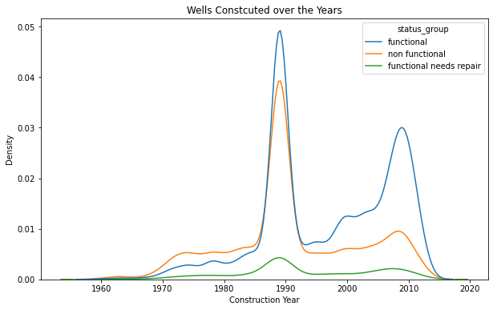

# Tanzania Water Wells

### Author: Paul Waweru Mbugua
##

## Overview
This project builds a classifier to predict the condition of a water well in Tanzania

## Business Problem
Tanzania, as a developing country, struggles with providing clean water to its population of over 57,000,000. There are many water points already established in the country, but some are in need of repair while others have failed altogether.

The government of Tanzania is focused on locating wells needing repair. 

## Objectives

To predict whether a water pump is working correctly.

## Data Understanding

### Data Description 
This project used data from [Driven Data](https://www.drivendata.org/competitions/7/pump-it-up-data-mining-the-water-table/page/23/).

Driven Data runs data science competitions. 

The datasets consist of the following:
- Test set values - The independent variables that need predictions
- Training set labels - The dependent variables (status_group) for each of the rows in the Training set values
- Training set values - The independent variables for the training set
- SubmissionFormat - The format to submit the predictions 

The features provides the following set of information about the waterpoints: 

- amount_tsh - Total static head (amount water available to waterpoint)
- date_recorded - The date the row was entered
- funder - Who funded the well
- gps_height - Altitude of the well
- installer - Organization that installed the well
- longitude - GPS coordinate
- latitude - GPS coordinate
- wpt_name - Name of the waterpoint if there is one
- num_private -
- basin - Geographic water basin
- subvillage - Geographic location
- region - Geographic location
- region_code - Geographic location (coded)
- district_code - Geographic location (coded)
- lga - Geographic location
- ward - Geographic location
- population - Population around the well
- public_meeting - True/False
- recorded_by - Group entering this row of data
- scheme_management - Who operates the waterpoint
- scheme_name - Who operates the waterpoint
- permit - If the waterpoint is permitted
- construction_year - Year the waterpoint was constructed
- extraction_type - The kind of extraction the waterpoint uses
- extraction_type_group - The kind of extraction the waterpoint uses
- extraction_type_class - The kind of extraction the waterpoint uses
- management - How the waterpoint is managed
- management_group - How the waterpoint is managed
- payment - What the water costs
- payment_type - What the water costs
- water_quality - The quality of the water
- quality_group - The quality of the water
- quantity - The quantity of water
- quantity_group - The quantity of water
- source - The source of the water
- source_type - The source of the water
- source_class - The source of the water
- waterpoint_type - The kind of waterpoint
- waterpoint_type_group - The kind of waterpoint

The labels in the dataset takes three possible values: 
- functional - the waterpoint is operational and there are no repairs needed
- functional needs repair - the waterpoint is operational, but needs repairs
- non functional - the waterpoint is not operational

I will not be needing the SubmissionFormat file. Also, I will drop some features from the Training set values and the Training set labels 

### Data Cleaning 
- Some of the columns contain missing values. scheme_name column has the most missing values followed by funder. There are no duplicates in the id column.

- Some columns communicate similar information. The basin, subvillage, region, region_code, district_code, lga, and ward communicate the geographic location of the wells. 

- Also, the scheme_management and scheme_name communicate who operates the waterpoint.  

- extraction_type, extraction_type_group, extraction_type_class relay informaion on the kind of extraction the waterpoint uses 

- payment and payment_type tell us what the water costs

- quantity and quantity group is the quality of water

- source and source type is the source of water

- waterpoint_type and water_point_type_group is the kind of water

I dropped some of the columns given their similarities in the columns

## Exprolatory Data Analysis 

- Most pumps were functional. However, a considerable amount were non functional, with the fewest functional but needing repairements. 

- A considerable portin of wells missed the year consructed entry. After filling the missing values with the median, the graph below shows the distribution of wells constructed over the years.

- Addittionally, most wells are powered by gravity, with the fewest powered by wind. Most of the wells powered by gravity are functional.

- Further, most wells are not paid for. Also, most of these wells are nonfunctional. The wells where consumers pay per bucket or monthly are mostly functional. 

- Most wells have good water quality

- Most wells draw their water from springs, shallow wells, rivers/lakes, and boreholes. Also, large proportions of wells drawing water from shallow wells and boreholes are non-functional. 

## Modeling 
### Logistic Regression 
- It was the baseline model
- The first step involved converting the status group column into interger data type. Here, I assigned the non functional wells 0, those functional but needing repair 1, and the functional 2. It was the target variable. 
- Next, i generated dummy variables, and split the data into Training and Testing sets.
- I created a pipeline that standardized the data and fit into logistic regression using sklearn module
- The baseline model had an accuracy score of 73.75% which was a good start. 

### Decision Tree Model
- The training accuracy score was 100%, while the test accuracy score was 75%. The model was highly overfitting. 
- The longitude, latitude, gps_height, and construction_year were the most important features

#### GridSearchCV
- I used Cross Validation while using GridSearch for model selection and hyperparameter. 
- I obtained the following results: 

  Mean Training Score: 83.34%

  Mean Test Score: 76.99%

  Best Parameter Combination Found During Grid Search: {'criterion': 'entropy', 'max_depth': 20, 'min_samples_leaf': 15, 'min_samples_split': 20} 

- The GridSeacrchCV improved the model perfromance. There close training and test scores indicate that there are no signs of overfitting. However, the model is as good as the combination of parameters included in the parameter grid. 

- The longitude, latitude, water_point_other, quantity_seasonal, quantity_other, and construction_year were the most important features for the decision tree. 

### Random Forests 
- The baseline model 
- Hyperparameter tuning using GridSearchCV indicated that the following were best parameters:

  Testing Accuracy: 79.31%

  Optimal Parameters: {'criterion': 'entropy', 'max_depth': None, 'min_samples_leaf': 3, 'min_samples_split': 5, 'n_estimators': 100}

- longitude, latitude, construction_year, gps_height, and quantity_enough were the most important features 

### XGBoost
- The basaline model performed well given that the training accuracy was 85.14%, while the test accuracy was 79.68%. 
- Again after applying the GridSearchCV, I obtained the following results

  Grid Search found the following optimal parameters: 
  
  learning_rate: 0.2
  
  max_depth: 6
  
  min_child_weight: 1
  
  n_estimators: 100
  
  subsample: 0.5

- The accuracy score for the training and test preduction was as follows. 

  Training Accuracy: 83.63%
  
  Validation accuracy: 79.48%

  The XGBoost significantly improved our model. The water_type_other, quantity_seasonal, extraction_type_class_other, quantity_insufficient, and quantity_other were the most important features.  

